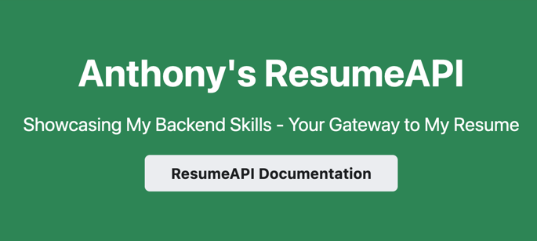

An API version of my resume, built using Java, Springboot, and MySQL

Why?:
* To develop my backend/api development skills, as well as get experience using a framework such as Spring Boot.
* To serve my resume in a fun and relevant way!

### Built With

### HTTP CALLS

GET /api/v1/fullResume

GET /api/v1/bio/getAll

GET /api/v1/edu/getAll

GET /api/v1/exp/getAll

GET /api/v1/activity/getAll

GET /api/v1/projects/getAll

GET /api/v1/skills/getAll

More to be implemented

### Constraints and Concerns

I am hoping to switch over the hosting of the backend service to my own Ubuntu Server VM hosted on Proxmox machine. This will allow me to provide reliable hosting for an indefinite amount of time, while also learning more about networking, docker, etc.

Project Link: [https://anthonywonjoon.github.io/resumeapi-docs](https://anthonywonjoon.github.io/resumeapi-docs)
